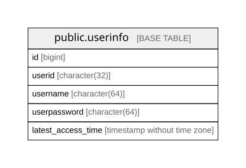

# mydatabase

## Tables

| Name | Columns | Comment | Type |
| ---- | ------- | ------- | ---- |
| [public.userinfo](public.userinfo.md) | 5 |  会員登録したユーザーの基本情報を管理するテーブル。  | BASE TABLE |

## Relations

---

> Generated by [tbls](https://github.com/k1LoW/tbls)
