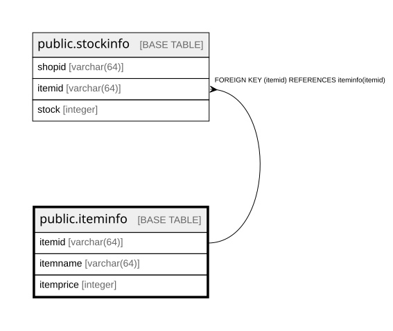

# public.iteminfo

## Description

商品の情報を管理するテーブル。  

## Columns

| Name | Type | Default | Nullable | Children | Parents | Comment |
| ---- | ---- | ------- | -------- | -------- | ------- | ------- |
| itemid | varchar(64) |  | false | [public.stockinfo](public.stockinfo.md) |  | 商品ID  |
| itemname | varchar(64) |  | false |  |  | 商品名  |
| itemprice | integer |  | false |  |  | 価格  |

## Constraints

| Name | Type | Definition |
| ---- | ---- | ---------- |
| iteminfo_itemid_not_null | n | NOT NULL itemid |
| iteminfo_itemname_not_null | n | NOT NULL itemname |
| iteminfo_itemprice_not_null | n | NOT NULL itemprice |
| iteminfo_pkey | PRIMARY KEY | PRIMARY KEY (itemid) |

## Indexes

| Name | Definition |
| ---- | ---------- |
| iteminfo_pkey | CREATE UNIQUE INDEX iteminfo_pkey ON public.iteminfo USING btree (itemid) |

## Relations

---

> Generated by [tbls](https://github.com/k1LoW/tbls)
