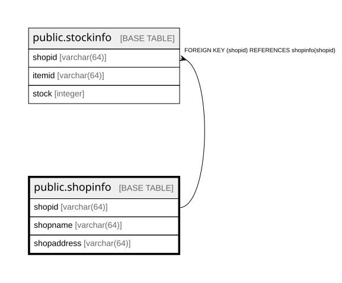

# public.shopinfo

## Description

お店の情報を管理するテーブル。  

## Columns

| Name | Type | Default | Nullable | Children | Parents | Comment |
| ---- | ---- | ------- | -------- | -------- | ------- | ------- |
| shopid | varchar(64) |  | false | [public.stockinfo](public.stockinfo.md) |  | お店ID  |
| shopname | varchar(64) |  | false |  |  | お店名  |
| shopaddress | varchar(64) |  | false |  |  | お店住所  |

## Constraints

| Name | Type | Definition |
| ---- | ---- | ---------- |
| shopinfo_shopaddress_not_null | n | NOT NULL shopaddress |
| shopinfo_shopid_not_null | n | NOT NULL shopid |
| shopinfo_shopname_not_null | n | NOT NULL shopname |
| shopinfo_pkey | PRIMARY KEY | PRIMARY KEY (shopid) |

## Indexes

| Name | Definition |
| ---- | ---------- |
| shopinfo_pkey | CREATE UNIQUE INDEX shopinfo_pkey ON public.shopinfo USING btree (shopid) |

## Relations

---

> Generated by [tbls](https://github.com/k1LoW/tbls)
