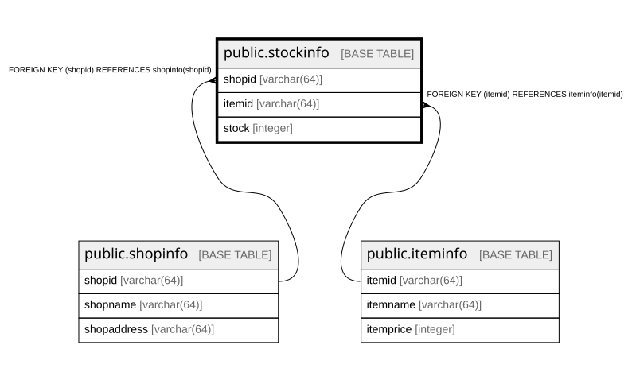

# public.stockinfo

## Description

商品の在庫情報を管理するテーブル。  

## Columns

| Name | Type | Default | Nullable | Children | Parents | Comment |
| ---- | ---- | ------- | -------- | -------- | ------- | ------- |
| shopid | varchar(64) |  | false |  | [public.shopinfo](public.shopinfo.md) | お店ID  |
| itemid | varchar(64) |  | false |  | [public.iteminfo](public.iteminfo.md) | 商品ID  |
| stock | integer |  | true |  |  | 在庫数  |

## Constraints

| Name | Type | Definition |
| ---- | ---- | ---------- |
| stockinfo_itemid_not_null | n | NOT NULL itemid |
| stockinfo_shopid_not_null | n | NOT NULL shopid |
| stockinfo_itemid_fkey | FOREIGN KEY | FOREIGN KEY (itemid) REFERENCES iteminfo(itemid) |
| stockinfo_shopid_fkey | FOREIGN KEY | FOREIGN KEY (shopid) REFERENCES shopinfo(shopid) |
| stockinfo_pkey | PRIMARY KEY | PRIMARY KEY (shopid, itemid) |

## Indexes

| Name | Definition |
| ---- | ---------- |
| stockinfo_pkey | CREATE UNIQUE INDEX stockinfo_pkey ON public.stockinfo USING btree (shopid, itemid) |

## Relations

---

> Generated by [tbls](https://github.com/k1LoW/tbls)
