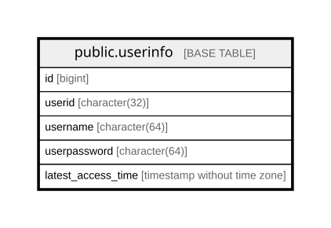

# public.userinfo

## Description

  
会員登録したユーザーの基本情報を管理するテーブル。  

## Columns

| Name | Type | Default | Nullable | Children | Parents | Comment |
| ---- | ---- | ------- | -------- | -------- | ------- | ------- |
| id | bigint |  | false |  |  |  |
| userid | character(32) |  | false |  |  |  ユーザーID  |
| username | character(64) |  | false |  |  |  ユーザー名  |
| userpassword | character(64) |  | false |  |  |  パスワード  |
| latest_access_time | timestamp without time zone | CURRENT_TIMESTAMP | false |  |  |  最終更新日時  |

## Constraints

| Name | Type | Definition |
| ---- | ---- | ---------- |
| userinfo_id_not_null | n | NOT NULL id |
| userinfo_latest_access_time_not_null | n | NOT NULL latest_access_time |
| userinfo_userid_not_null | n | NOT NULL userid |
| userinfo_username_not_null | n | NOT NULL username |
| userinfo_userpassword_not_null | n | NOT NULL userpassword |
| userinfo_pkey | PRIMARY KEY | PRIMARY KEY (id) |

## Indexes

| Name | Definition |
| ---- | ---------- |
| userinfo_pkey | CREATE UNIQUE INDEX userinfo_pkey ON public.userinfo USING btree (id) |

## Relations

---

> Generated by [tbls](https://github.com/k1LoW/tbls)
